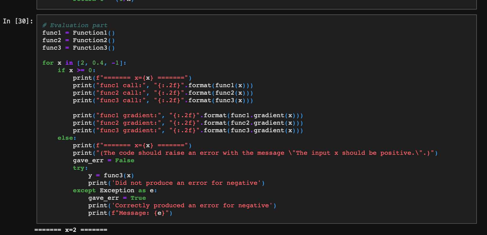

# rlhf-vision

A minimal example that uses the pretrained **ImageReward** RLHF reward model to score how well an image matches a set of text prompts.

## Overview

Reinforcement Learning from Human Feedback (RLHF) for text-to-image generation relies on a *reward model* that predicts human preference for a given (prompt, image) pair. [ImageReward](https://github.com/THUDM/ImageReward) is one such model, trained on large-scale human comparisons of generated images. This repository is a small, self-contained demo: it loads the pretrained `ImageReward-v1.0` checkpoint and prints the reward score for a single sample image against several prompts. It is a usage example, not a training or re-implementation of the model.

## Requirements

The demo script imports `ImageReward` only; the package itself pulls in PyTorch, CLIP, and BLIP dependencies. Install with:

```bash
pip3 install image-reward
pip3 install clip
```

A working Python 3 environment with internet access is needed on first run, because `ImageReward-v1.0` weights are downloaded automatically by `RM.load(...)`.

## Usage

The example lives in [`example_code/`](example_code) and expects the sample image (`code.png`) to be in the working directory, so run it from inside that folder:

```bash
cd example_code
python3 ImageReward_inference.py
```

What the script does ([`example_code/ImageReward_inference.py`](example_code/ImageReward_inference.py)):

```python
import ImageReward as RM
model = RM.load("ImageReward-v1.0")
prompts = ["code screenshot", "python", "python snake", "python code"]
img_paths = ["code.png"]
for prompt in prompts:
    reward = model.score(prompt, img_paths)
    print(f"{prompt}: {reward}")
```

`model.score(prompt, img_paths)` returns a scalar reward for each prompt/image pair — a higher value means the image is judged to better match the prompt / be more human-preferred. To try your own inputs, change the `prompts` list and point `img_paths` at your own image file(s).

Example output recorded in the script for the bundled `code.png`:

```
code screenshot: 0.9415892362594604
python: -0.4653015434741974
python snake: -1.3486034870147705
python code: 0.5567578673362732
```

## Example image

The demo scores the following image (a screenshot of a Python code cell), for which the prompt `"code screenshot"` earns the highest reward:



## Citation

This repo simply applies the pretrained ImageReward model. Please cite the original authors:

```bibtex
@inproceedings{xu2023imagereward,
  title={ImageReward: Learning and Evaluating Human Preferences for Text-to-Image Generation},
  author={Xu, Jiazheng and Liu, Xiao and Wu, Yuchen and Tong, Yuxuan and Li, Qinkai and Ding, Ming and Tang, Jie and Dong, Yuxiao},
  booktitle={Thirty-seventh Conference on Neural Information Processing Systems},
  year={2023}
}
```

## License

Released under the [MIT License](LICENSE).
